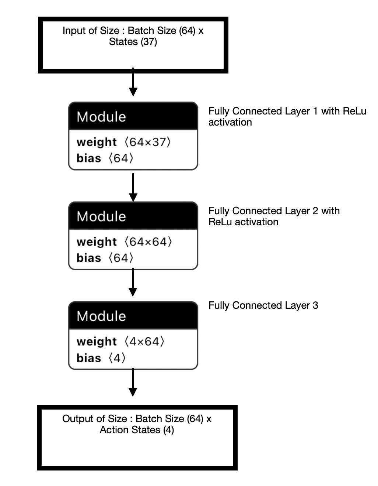
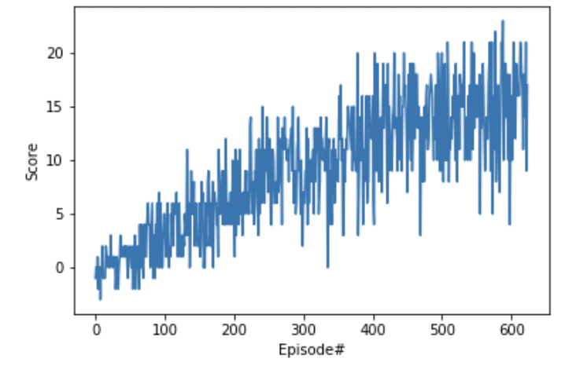

# Report 

## DQN Algorithm 

### Local and Target Networks 
The agent uses a standard DQN algorithm consisting of a local and target network. This part replaces the lookup table process of the traditional Q-learning. Two networks are used to combat correlations that can occur in the observation space and between Q-values and the TD-target value. Also small Q-value updates may significantly change the policy which can lead to drastic instabilities. The target network is updated every 4 episodes in this case by copying the weights from the local network. 

### Experience Replay
Experience replay is also used to combat correlations in the training data. 
It essentially collects a database of previous examples to learn from and is inspired by supervised learning. A replay buffer is used to store a number of previous examples and is sampled at random. This prevents high oscillations and reduces the risk of divergence. The replay buffer consists of tuples each containing ```<states,actions,reward,next state>```. In this simler project ER does not make a real difference. 


### Epsilon Greedy Mechanism
Epsilon Greedy is used to explore the action space by choosing the non optimal action according to the Q-value with a probability of epsilon. This allows the agent to explore strategies which may be better than the current optimal one and learn about different action sequences. Typically, epsilon is annealed during the training process. 

### Loss Function  
The loss function is choosen to be the Mean Squared Error Loss which calculates the loss between Q_target (computed with the output the target network) and Q_expected (computed with the ouput of the local network). This loss is then used to backpropagate the error and perform an update step according to the optimizer that is used. 


### Network 

The model is a very simple network with 3 fully connected layers and ReLu activations as shown below. [Netron](https://github.com/lutzroeder/netron) is used to visualize the model. 
It receives an input of the current environment state with a size of ```Batch Size x States``` and outputs actions of size ```Batch Size x Actions```. In this case the state space consists of 37 states and the action space of 4 actions. The model is trained with the Adam optimizer. The size of the two hidden layers is 64 units each. 



### Hyperparameters

```python
BUFFER_SIZE = int(1e5)  # replay buffer size     
BATCH_SIZE = 64         # minibatch size     
GAMMA = 0.99            # discount factor       
TAU = 1e-3              # for soft update of target parameters      
LR = 5e-4               # learning rate                    
UPDATE_EVERY = 4        # how often to update the network            
```

### Results

The agent achieves the required score of 13.0 after about 510 episodes. However in this case the agent was trained until it reached a score of 15.0 which took 624 episodes. The corresponding plot is shown below. 



### Possible Improvements 

- Double DQN (DDQN)
- Prioritized experience replay
- Dueling DQN
- Learning from multi-step bootstrap targets 
- Distributional DQN
- Noisy DQN
- Rainbow (a combination of all six methods above)

The image of the Rainbow paper by DeepMind shows the improvement that Rainbow achieves over the use of sinlge methods on 57 Atari Games. Both convergence and final performance significantly improve.


#### Useful Links 
- [Experience replay and double learning](https://jaromiru.com/2016/11/07/lets-make-a-dqn-double-learning-and-prioritized-experience-replay/)
- [PER implementation](https://github.com/Damcy/prioritized-experience-replay)
- [PER paper](https://arxiv.org/abs/1511.05952)
- [DeepRL doesn't work yet](https://www.alexirpan.com/2018/02/14/rl-hard.html)
- [Rainbow demistifiying](https://medium.com/intelligentunit/conquering-openai-retro-contest-2-demystifying-rainbow-baseline-9d8dd258e74b)
- [Rainbow paper](https://arxiv.org/abs/1710.02298)
